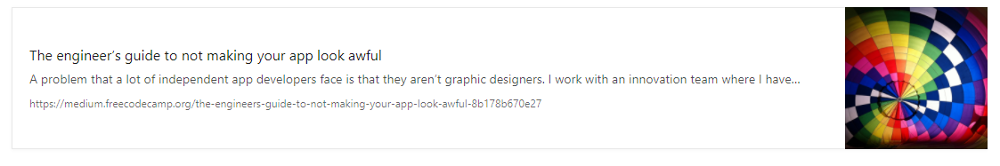

# Link preview microservice
This webserver renders a link preview by scraping the submitted link.

## Usage
Make a `GET` request to the server [https://linkpreviewer.herokuapp.com/](https://linkpreviewer.herokuapp.com/) passing link (shortened urls are ok, e.g. [https://goo.gl/epMmfm](https://goo.gl/epMmfm)) and format (optional) in the URL query. Format can be either json or html, html by default.

E.g.
[https://linkpreviewer.herokuapp.com/?link=https://goo.gl/epMmfm&format=json](https://linkpreviewer.herokuapp.com/?link=https://goo.gl/epMmfm&format=json) returns
```json
{
  "title": "The engineer’s guide to not making your app look awful",
  "description": "A problem that a lot of independent app developers face is that they aren’t graphic designers. I work with an innovation team where I have…",
  "image": "https://cdn-images-1.medium.com/max/1200/1*snMthttokp8m2AWo9dLN7A.jpeg"
}
```

## Style
If you want to use the pre-rendered HTML you should include [this](https://github.com/ZaninAndrea/linkPreview/blob/master/style.css) css in the page

## Remix
You can remix this project on glitch

[](https://glitch.com/edit/#!/remix/https://clover-hour.glitch.me/)
